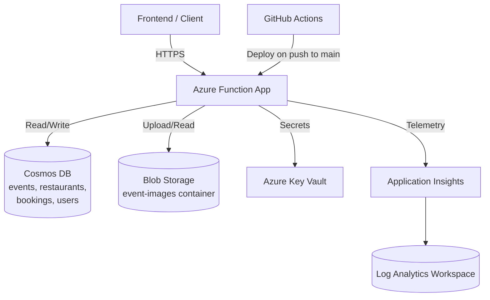

# EventEase Backend

A serverless backend for **EventEase** — an event booking and restaurant discovery platform — built on Azure Functions, Cosmos DB, and Blob Storage. This project is the capstone for the CloudOps Enterprise Platform coursework, covering the full lifecycle from infrastructure provisioning to CI/CD and production monitoring.

## Architecture



## Tech Stack

| Layer | Technology |
|---|---|
| Compute | Azure Functions (Node.js 18, v4 programming model) |
| Database | Azure Cosmos DB (Core/SQL API, serverless) |
| File Storage | Azure Blob Storage |
| Secrets | Azure Key Vault |
| Infrastructure as Code | Terraform |
| CI/CD | GitHub Actions |
| Monitoring | Application Insights (workspace-based) + Log Analytics |

## Project Status

| Module | Description | Status |
|---|---|---|
| 1 | Azure setup | ✅ |
| 2 | Infrastructure (Terraform) | ✅ |
| 3 | Frontend | ✅ |
| 4 | Backend API | ✅ |
| 5 | Database | ✅ |
| 6 | File storage (image uploads) | ✅ |
| 7 | Security (Key Vault) | ✅ |
| 8 | CI/CD | ✅ |
| 9 | Monitoring & finish | ✅ |

## API Endpoints

All endpoints are hosted at `https://eventease-backend-func.azurewebsites.net/api/`.

| Function | Method | Route | Description |
|---|---|---|---|
| `HealthCheck` | GET, POST | `/HealthCheck` | Basic liveness check |
| `Register` | POST | `/Register` | Register a new user |
| `Login` | POST | `/Login` | User login |
| `CreateEvent` | POST | `/CreateEvent` | Create a new event |
| `ListEvents` | GET | `/ListEvents` | List all events |
| `BookEvent` | POST | `/BookEvent` | Book a spot at an event |
| `CreateRestaurant` | POST | `/CreateRestaurant` | Add a restaurant |
| `ListRestaurants` | GET | `/ListRestaurants` | List all restaurants |
| `UploadImage` | POST | `/UploadImage` | Upload an image, returns a public blob URL |

### Example: Uploading an image and attaching it to a restaurant

```bash
# 1. Upload the image
curl -X POST https://eventease-backend-func.azurewebsites.net/api/UploadImage \
  -H "Content-Type: image/jpeg" \
  --data-binary "@photo.jpg"
# → { "imageUrl": "https://.../event-images/<uuid>.jpeg" }

# 2. Use the returned URL when creating a restaurant
curl -X POST https://eventease-backend-func.azurewebsites.net/api/CreateRestaurant \
  -H "Content-Type: application/json" \
  -d '{"name": "Spice Route", "cuisine": "Indian", "location": "Bengaluru", "imageUrl": "<url from step 1>"}'
```

## Infrastructure (Terraform)

All Azure resources are defined in `eventease-terraform/main.tf`:

- Resource Group, Storage Account, Service Plan, Linux Function App
- Cosmos DB account + database + containers (`users`, `events`, `bookings`, `restaurants`)
- Blob container `event-images` (public blob-level read access)
- Key Vault for secrets
- Application Insights (region: `eastasia`, matching the Function App)

> **Note:** the Function App resource uses `lifecycle { ignore_changes = [app_settings, site_config] }`, so app settings (connection strings, feature flags) are managed via `az functionapp config appsettings set`, not Terraform, after initial provisioning.

## CI/CD

Every push to `main` triggers `.github/workflows/deploy.yml`, which:
1. Checks out the code
2. Installs Node dependencies
3. Deploys to Azure Functions using the `AZURE_FUNCTIONAPP_PUBLISH_PROFILE` secret

## Monitoring

Application Insights is workspace-based — telemetry lands in a Log Analytics workspace rather than classic component storage. Query it with:

```bash
az monitor log-analytics query \
  --workspace "<workspace-GUID>" \
  --analytics-query "AppRequests | order by TimeGenerated desc | take 10" \
  --output table
```

(Note the `App` prefix on table names — `AppRequests`, `AppTraces` — and `TimeGenerated` instead of `timestamp`, which differ from the classic Application Insights schema.)

Live, real-time traffic can also be viewed via **Application Insights → Live Metrics** in the Azure Portal.

## Local Development

```bash
git clone https://github.com/Candy1409/eventease-backend.git
cd eventease-backend
npm install
func start
```

Requires `local.settings.json` with `AzureWebJobsStorage`, `COSMOS_DB_CONNECTION_STRING`, and `APPLICATIONINSIGHTS_CONNECTION_STRING` set (not committed to source control).
